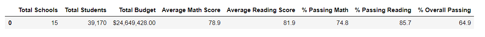

# School_District_Analysis

## Overview
Maria has asked for out assistance in the analysis of testing in a school district using Anaconda systems. The district is composed of 15 high schools both charter and public. Data was given to us in csv form to clean up and make it presentable for Maria to be able to present to stakeholders. To begin with Maria is looking for these deliverables:

- Top 5 performing schools
- Bottom 5 performing schools
- Average math score received by student in each grade level, per school
- Average reading score received by student in easg grade level, per school
- School Performance based on budget
- School Performance based on school size
- School Performance based on school type

All this information can be found in the PyCitySchools.ipynb file. Once we were finished with our report it was discovered the the 9th grade class at Thomas High School (THS) had cheated and all their scores were diqualified. We had to re-evaluate all our findings and reports to adjust for this change. Initially removing all the math and reading scores from the data for the 9th grade class in THS, replacing those with NaN. Then re-calculating the rest of the school's totals and percentages and pluging this information in the completed report. This analysis will review our actions with the report and the difference removing the Thomas High School 9th grade class made.

## Results

### Overall District Results
After cleaning up the raw data it was determined that there were 39,170 student in the 15 high schools in the region. The selection of schools looks pretty even in type, school size, and funding per student. Students that went to Charter schools received higher scores that students in public schools. Smaller class sizes or schools with less students also had the best outcomes in the testing. 

#### Results of District v. Charter

#### Class size and testing outcomes

The per capita cost of schooling didn't make too much difference in the testing outcome of the students, students that did better had a lower cost per capita.

#### Cost per student and testing

From this data it can be determined that smaller class sizes will produce better test scores. As a school board it would be a good idea to review the district/public high schools where we spend a lot of money and their testing is under 55%. There is more money spend per student in these schools and yet their scores don't reflect this investment. It would be wise to review how the money is spent and how that can be re-allocated to serve the student and their communities better. 

### Thomas High School 9th graders
The Challenge wanted us to alter the data once an incident was discovered in the grades reported for Thomas High School 9th graders. It was reported that some of the students were cheating in their tests and since we couldn't figure how many were involved the district decided to null all their scores. A "loc" method was used to find these math and reading scores and replace them with "NaN". This is the script used:

student_data_df.loc[(student_data_df["school_name"]== "Thomas High School") & (student_data_df["grade"]== "9th"), "reading_score"]= np.NaN

This was repeated to null the math scores in the data. The rest of the data was then re-analyzed. Although we removed scores for a whole class the difference in Thomas High schools overall outcomes were minimal. Changes in budget and per capita were didn't change because these were already commited. 

Districtwide the removal of the 9th grade class from Thomas HS showed very little change:
#### District Summary

#### District Summary with the removal of the 9th grade class scored from Thomas High School

Likewise for Thomas High School and their overall statistics, removing the 9th grade class didn't make too much difference in their scores.  They remained in the top 5 schools in the district, their ranking didn't change.

#### Top 5 Schools in the District from original data

#### Top 5 Schools in District after removing THS 9th grade class

From the reported scores it looks like all the student at Thomas High School have the same great level of education since the removal of a whole class didn't effect their overall performance. 

Overall the district needs to review with it's public schools, those test scores are lower that the charters. It's not in their budgets but their allocations might needs to be reviewed. Public schooling is investing more in their students so the need is to be reviewed. Charters with a whole class reviewed didn't lose any ranking. It would be interesting to see how a similar event would have effected the results of the district instituetions. 
